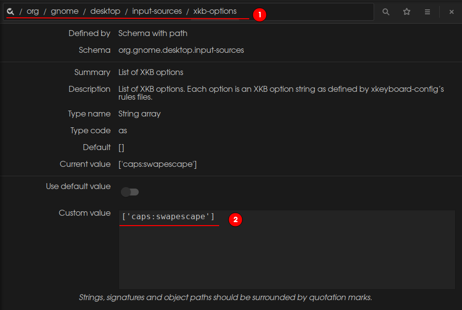

# Vim Config

## 第一件事
将Caps键映射为Esc(正常键盘Esc太远了,当然如果是客制化键盘,当我没说)  
Ubuntu下我用的是一款叫做dconf Editor的软件(当然你也可以用gsetting),Windows就自己改注册表
下载该软件,然后将找到(1)所在的位置,照着(2)改 


## 插件
* LaTeX(LaTeX入门劝退,不过Tex Gyre Adventor Regular字体挺好看的)
```
Plug 'lervag/vimtex'

```
* coc.nvim代码补全(永远的神!)
```
Plug 'neoclide/coc.nvim', {'branch': 'release'}
```

* fzf模糊查找(没怎么用过，主要文件不多)
```
"Plug 'junegunn/fzf', { 'do': { -> fzf#install() } }
```
* 代码调试(一般不怎么用...一直用的Termdebug)
```
Plug 'puremourning/vimspector'
```

* 背景主题(gruvbox稳重，oceanic-next活跃)
```
Plug 'mhartington/oceanic-next'

Plug 'morhetz/gruvbox'
```

* 代码小片段(永远的神!)
```
Plug 'honza/vim-snippets'
Plug 'SirVer/ultisnips'
```

* 状态栏(原生就最好看，其他的太花哨没有用)
```
Plug 'vim-airline/vim-airline'
```
* 文件树(一般也不用,麻烦)
```
"Plug 'preservim/nerdtree'
```

* 快速注释(还行)
```
Plug 'preservim/nerdcommenter'
```
* vim开始页面(好用)
```
Plug 'mhinz/vim-startify'
```

* 彩虹括号(骚包)
```
Plug 'luochen1990/rainbow'
```

* vim-terminal(没咋用过)
```
Plug 'skywind3000/vim-terminal-help'
```

* Markdown(用着挺顺手的)
```
Plug 'godlygeek/tabular' "必要插件，安装在vim-markdown前面
Plug 'plasticboy/vim-markdown'
```

* 光标生成目录(没啥体会)
```
Plug 'mzlogin/vim-markdown-toc'
```

* markdown-preview(有点不习惯，切换窗口会把Chrome的标签页关了)
```
Plug 'iamcco/markdown-preview.nvim', { 'do': { -> mkdp#util#install() }, 'for': ['markdown', 'vim-plug']}
```
## 组合键(实在讨厌Ctrl键，太难按了)
|   作用    |    原生       |   映射  	|
| ------------- |-------------  | ------- |
|    切换窗口    |    <kbd>C-W</kbd> + <kbd>hkjl</kbd> |  <kbd>leader</kbd>+<kbd>leader</kbd> + <kbd>hjkl</kbd>

